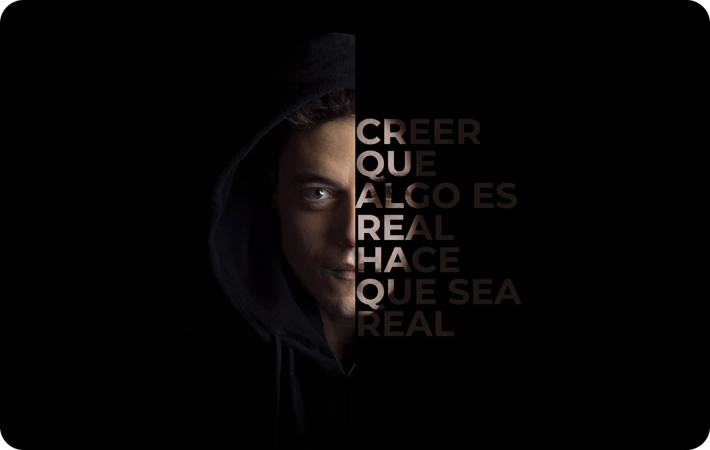

# Masking Text on Image

## Description

This is a small design project in HTML and CSS that seeks to emulate a feature widely used in graphic design tools such as Photoshop, Figma and other image editors. This is the effect of a text layer mask superimposed on an image, achieved through styling and layout techniques in CSS. Through this project, I have created a visual experience that allows users to creatively add text over a background image, giving them the ability to customize and stylize the text according to their preferences. This recreation of a text layer mask in CSS is an example of how attractive and functional visual effects can be achieved in web design, demonstrating my skill in creating stunning visual elements using front-end technologies such as HTML and CSS.

## Live Demo

You can experience Masking Text on Image and explore by visiting the live demo [Live Demo](https://codenaud.github.io/masking-text-on-image/)

## Features

- Text Mask Effect: Allows you to create a visual text mask effect on an image in a simple way.
- Creative Customization: Adjust the text and image according to your design and style preferences.
- Intuitive Interface: An easy-to-use user interface that does not require advanced technical knowledge.
- Cross-platform Compatibility: Works on multiple browsers and devices, ensuring a consistent experience.

## Technologies Used

Masking Text on Image project has been developed using the following technologies:

- HTML5: HTML5 is used to structure and organize the content of the web page.
- CSS3: CSS3 is used to apply styles and visual effects, including text masking.
- Figma and Photoshop: For designing the layout and visuals.
- Git: Git is used for version control and tracking changes to the project.
- GitHub: GitHub is used to host and collaborate on the project repository.
- Code Editor: A code editor is used to write and edit the source code of the project.

## Badges/Shields

Dev Skills

Design Skills

Build with

## Acknowledgments

This project would not have been possible without the incredible community of developers and designers who continually inspire and support each other.

To make this application I have used several resources that I share below.

---

    - Duotone Gradients
    - Web: [URL](https://resourceboy.com/photoshop-gradients/duotone-gradients/)

    --> 200 Duotone Photoshop Gradients

---

    - Youtube Tutorials
    - Youtube: [URL](https://www.youtube.com/@lundeveloper)

    --> @lundeveloper

    - Youtube Tutorials
    - Youtube channel: [URL](https://www.youtube.com/@KevinPowell)

    --> @KevinPowell

---

## About Me

I'm a junior frontend developer passionate about HTML, CSS and JavaScript, who wants to share the work of all the people who have helped me on the way to being able to dedicate myself to what I like the most.

## Contact

If you have any questions or suggestions, do not hesitate to contact me through my email: [codenaud@gmail.com](mailto:codenaud@gmail.com)

Happy coding! 🚀
